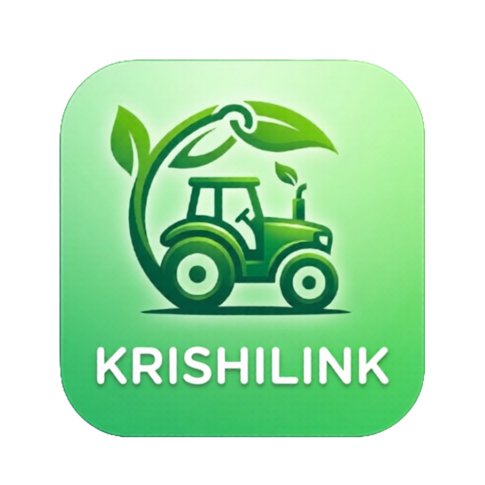
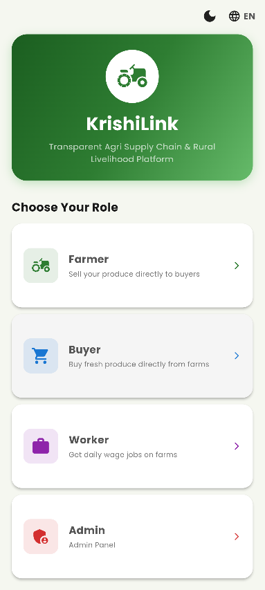
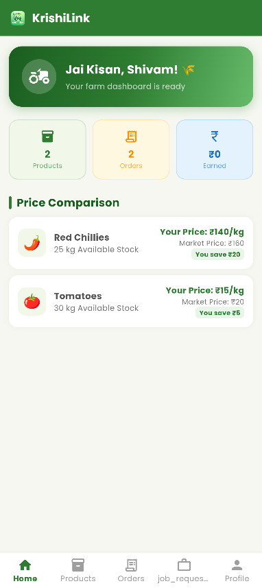
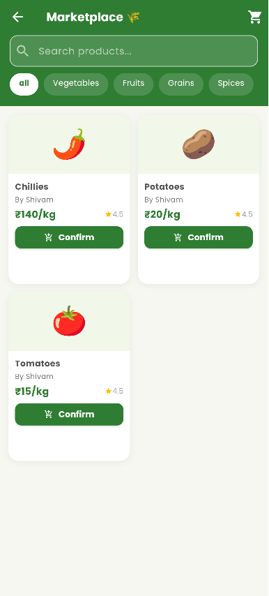
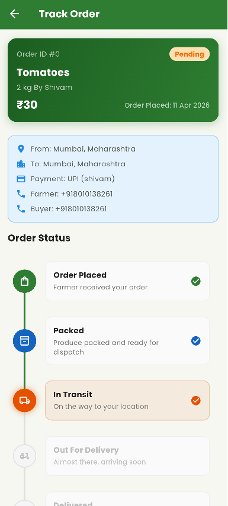

<div align="center">



# 🌾 KrishiLink

### *Transparent Agri Supply Chain & Rural Livelihood Platform*


**Empowering 600 million rural Indians — one crop, one job, one fair deal at a time.**

🏆 **Track:** Rural Innovation & Agritech
📋 **Problem Statement:** Smart Farming Decision Support Platform
👥 **Team:** GigaByteX

</div>

---

## 🎯 The Problem

India's agricultural sector, despite employing **60% of the rural workforce**, suffers from chronic inefficiencies:

- 🔗 **Multiple middlemen** eat up 30–50% of a farmer's earnings
- 📉 **Zero price transparency** — farmers sell at MSP or below while retail prices are 3–5× higher
- 👷 **No structured job market** for 150M+ rural agricultural laborers
- 🌐 **Digital divide** — existing platforms are English-only and inaccessible to rural users
- 📦 **No supply chain visibility** for buyers — zero farm-to-fork traceability

---

## 💡 Our Solution

**KrishiLink** directly connects **farmers**, **buyers**, and **agricultural workers** — cutting out middlemen, providing real-time supply chain tracking, multilingual access, and smart decision support, all in a single mobile app built for rural India.

---

## ✨ Key Features

| Role | Features |
|------|----------|
| 👨‍🌾 **Farmer** | Product listing, order management, price transparency dashboard, rural job board, earnings tracker |
| 🛒 **Buyer** | Live marketplace, cart & checkout (COD/UPI), 5-step order tracking, auto-delivery after 3 days, direct farmer contact |
| 👷 **Worker** | Job discovery, one-tap application, application status tracker, profile dashboard |
| 🛡️ **Admin** | Platform analytics (fl_chart), user management, weekly revenue chart, report downloads |
| 🌐 **All Users** | Dark/Light mode, multilingual (English / हिंदी / मराठी), Firebase Phone OTP, offline-aware, real-time streams |

---

## 🧠 Smart Farming Decision Support

KrishiLink goes beyond a simple marketplace — it functions as a **decision support platform** for rural farmers:

- 📊 **Price Transparency Dashboard** — farmers see real market rates vs. what middlemen offer
- 🗂️ **Crop Category Intelligence** — supports Vegetables, Fruits, Grains, Dairy, Spices, Pulses
- 📦 **5-Stage Supply Chain Tracking** — Harvested → Packed → In Transit → Out for Delivery → Delivered
- 💼 **Rural Job Board** — connects 150M+ agricultural laborers with seasonal farm work
- 📡 **Offline-Aware Architecture** — works in low-connectivity rural areas via local caching

---

## 🌍 Social Impact

KrishiLink directly addresses **4 United Nations Sustainable Development Goals**:

| SDG | Goal |
|-----|------|
| 🟥 SDG 1 | No Poverty |
| 🟧 SDG 2 | Zero Hunger |
| 🟦 SDG 8 | Decent Work & Economic Growth |
| 🟪 SDG 10 | Reduced Inequality |

---

## 📸 Screenshots

> Add screenshots to a `screenshots/` folder in the project root and the images below will render automatically.

| Landing | Farmer Dashboard | Marketplace | Order Tracking |
|---------|-----------------|-------------|----------------|
|  |  |  |  |

---

## 🏗️ Architecture

### Tech Stack

- **Frontend:** Flutter 3.x (Dart), Material 3, Provider, flutter_animate, fl_chart, timeline_tile
- **Backend:** Firebase Auth (Phone OTP), Cloud Firestore, Firebase Storage
- **Localization:** flutter_localizations — English, Hindi, Marathi
- **Offline Support:** shared_preferences + connectivity_plus

### Project Structure

```
lib/
├── main.dart
├── firebase_options.dart
├── models/
│   ├── user_model.dart
│   ├── product_model.dart
│   ├── order_model.dart
│   └── job_model.dart
├── screens/
│   ├── splash_screen.dart
│   ├── landing_screen.dart
│   ├── login_screen.dart
│   ├── farmer_dashboard.dart
│   ├── buyer_dashboard.dart
│   ├── admin_dashboard.dart
│   ├── marketplace_screen.dart
│   ├── tracking_screen.dart
│   ├── job_board_screen.dart
│   └── farmer_job_applications_screen.dart
├── services/
│   ├── firebase_auth_service.dart
│   └── firestore_service.dart
├── utils/
│   ├── app_localizations.dart
│   ├── constants.dart
│   ├── theme_provider.dart
│   └── locale_provider.dart
└── widgets/
    ├── custom_button.dart
    ├── product_card.dart
    ├── job_cart.dart
    ├── tracking_timeline.dart
    └── language_switcher.dart
```

---

## 🚀 Quick Start

### Prerequisites

- Flutter SDK ≥ 3.0.0
- A Firebase project (phone auth is free — Identity Toolkit must be enabled)
- Android Studio or VS Code

### 1. Clone & Install

```bash
git clone https://github.com/dighadepranav/krishilink.git
cd krishilink
flutter pub get
```

### 2. Firebase Setup

```bash
# Install FlutterFire CLI
dart pub global activate flutterfire_cli

# Link your Firebase project
flutterfire configure
```

This auto-generates `lib/firebase_options.dart` for your environment.

### 3. Run the App

```bash
flutter run
```

---

## 📦 Dependencies

| Package | Version | Purpose |
|---------|---------|---------|
| `provider` | ^6.0.5 | State management |
| `firebase_core` | ^3.8.0 | Firebase initialization |
| `firebase_auth` | ^5.3.0 | Phone OTP authentication |
| `cloud_firestore` | ^5.5.0 | Real-time database |
| `firebase_storage` | ^12.3.0 | Image & file uploads |
| `fl_chart` | ^0.68.0 | Admin analytics charts |
| `timeline_tile` | ^2.0.0 | Order tracking UI |
| `flutter_animate` | ^4.5.0 | Smooth animations |
| `shimmer` | ^3.0.0 | Loading placeholders |
| `cached_network_image` | ^3.3.1 | Efficient image loading |
| `connectivity_plus` | ^5.0.2 | Offline awareness |
| `image_picker` | ^1.0.7 | Product image upload |
| `url_launcher` | ^6.2.4 | External links |
| `shared_preferences` | ^2.2.2 | Local data caching |
| `flutter_localizations` | SDK | Multi-language support |
| `intl` | ^0.20.2 | Date & number formatting |

---

## 🌐 Localization

The app ships with three languages out of the box:

| File | Language |
|------|----------|
| `assets/translations/en.json` | English |
| `assets/translations/hi.json` | Hindi / हिंदी |
| `assets/translations/mr.json` | Marathi / मराठी |

To add a new language, create a new JSON file in `assets/translations/` following the existing key structure, then register the locale in `LocaleProvider`.

---

## 🗂️ Assets

```
assets/
├── fonts/
│   ├── Poppins-Regular.ttf
│   └── Poppins-Bold.ttf
├── images/
│   ├── logo.png
│   ├── farmer_placeholder.png
│   └── product_placeholder.png
└── translations/
    ├── en.json
    ├── hi.json
    └── mr.json
```

---

## 👥 Team GigaByteX

| Name | GitHub | Role |
|------|--------|------|
| Pranav Gajanan Dighade | [@dighadepranav](https://github.com/dighadepranav) | 👑 Team Leader |
| Ajay Bhanwarlal Chaudhary | [@ajay262628](https://github.com/ajay262628) | ⚙️ Member |
| Shivam Gajanan Burkul | [@shivamburkul](https://github.com/shivamburkul) | ⚙️ Member |
| Rahul Jodharam Choudhary | [@RahulChoudhary03](https://github.com/RahulChoudhary03) | ⚙️ Member |

---

## 📞 Support

- 📧 Email: support@krishilink.com
- 📱 Helpline: +91 1800-123-4567

---

## 📄 License

This project is licensed under the [MIT License](LICENSE).

---

<div align="center">

*Built with ❤️ by Team GigaByteX — for the farmers of Bharat* 🇮🇳

</div>